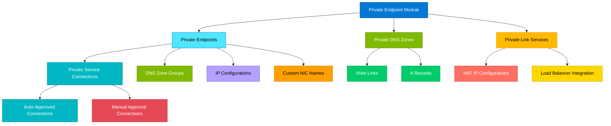

# terraform-azure-private-endpoint

Production-ready Terraform module for deploying Azure Private Endpoints with comprehensive support for private DNS zones, DNS zone groups, private link service connections, approval workflows, network interface configuration, and multiple subresources.

## Architecture



## Features

- Private Endpoint creation with automatic or manual connection approval
- Private service connections to any Azure PaaS resource or Private Link Service
- Multiple subresource support (blob, file, queue, table, vault, sqlServer, etc.)
- Private DNS Zone management with SOA record configuration
- DNS Zone virtual network links with optional auto-registration
- Custom DNS A record management
- Private Link Service creation with NAT IP configuration
- Static IP assignment for private endpoints via IP configurations
- Custom network interface naming
- Support for resource ID or alias-based connections
- Cross-subscription and cross-tenant connectivity
- Comprehensive tagging support

## Usage

```hcl
module "private_endpoint" {
  source = "path/to/terraform-azure-private-endpoint"

  private_endpoints = {
    "storage-blob" = {
      name                = "pe-storage-blob"
      resource_group_name = "rg-myapp"
      location            = "East US"
      subnet_id           = azurerm_subnet.endpoints.id

      private_service_connection = {
        name                           = "psc-storage-blob"
        private_connection_resource_id = azurerm_storage_account.this.id
        subresource_names              = ["blob"]
      }

      private_dns_zone_group = {
        name                 = "blob-dns-group"
        private_dns_zone_ids = [azurerm_private_dns_zone.blob.id]
      }
    }
  }
}
```

## Examples

- [Basic](./examples/basic/) - Simple private endpoint for a storage account
- [Advanced](./examples/advanced/) - Multiple endpoints with DNS zones and VNet links
- [Complete](./examples/complete/) - Full setup with Private Link Service, DNS zones, A records, and consumer endpoints

## Requirements

| Name | Version |
|------|---------|
| terraform | >= 1.3.0 |
| azurerm | >= 3.80.0 |

## Inputs

| Name | Description | Type | Default | Required |
|------|-------------|------|---------|----------|
| private_endpoints | Map of private endpoints to create | `map(object)` | `{}` | no |
| private_dns_zones | Map of private DNS zones | `map(object)` | `{}` | no |
| dns_zone_virtual_network_links | Map of VNet links for DNS zones | `map(object)` | `{}` | no |
| dns_a_records | Map of DNS A records | `map(object)` | `{}` | no |
| private_link_services | Map of Private Link Services | `map(object)` | `{}` | no |
| default_tags | Default tags for all resources | `map(string)` | `{}` | no |

## Outputs

| Name | Description |
|------|-------------|
| private_endpoint_ids | Map of endpoint keys to IDs |
| private_endpoint_ip_addresses | Map of endpoint keys to private IPs |
| private_endpoint_fqdns | Map of endpoint keys to DNS configs |
| private_dns_zone_ids | Map of DNS zone keys to IDs |
| private_dns_zone_names | Map of DNS zone keys to names |
| private_link_service_ids | Map of PLS keys to IDs |
| private_link_service_aliases | Map of PLS keys to aliases |

## License

MIT License - see [LICENSE](./LICENSE) for details.
